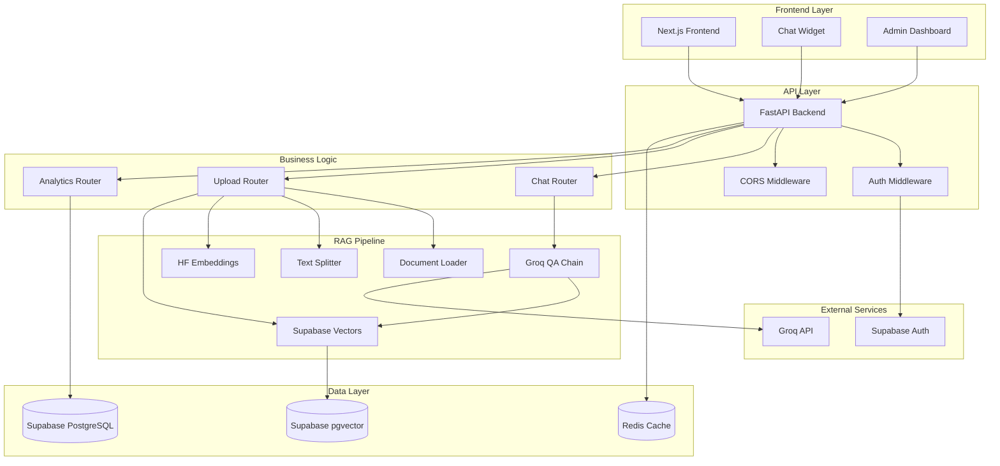
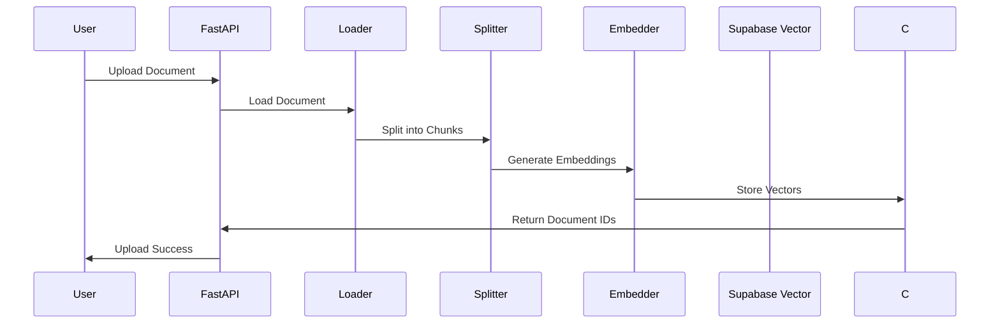
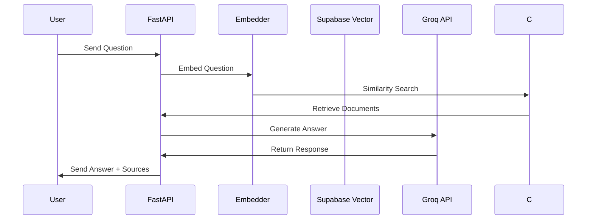
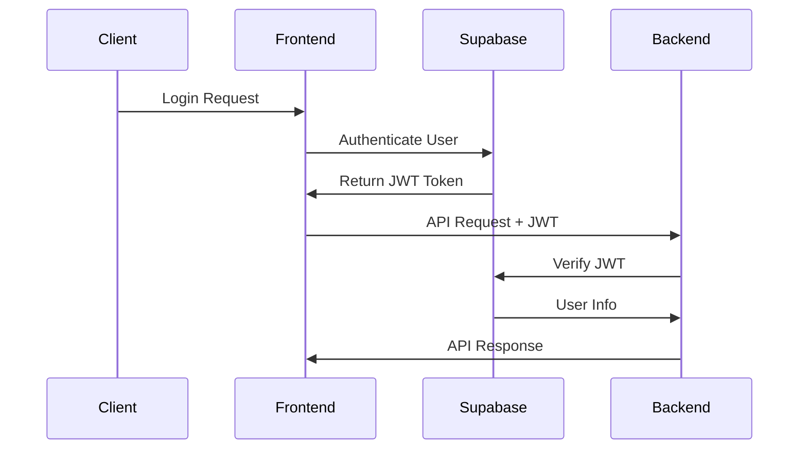

# 🏗️ Architecture du Support Chatbot

## Vue d'Ensemble

Le Support Chatbot est une application moderne construite selon une architecture microservices avec séparation claire entre le frontend, backend, et les services de données.

## Diagramme d'Architecture



## Composants Détaillés

### 1. Frontend Layer

#### Next.js 14 Application
- **App Router** : Nouveau système de routage avec layouts
- **Server/Client Components** : Optimisation des performances
- **TypeScript** : Typage statique complet
- **Tailwind CSS** : Styling moderne et responsive

#### Chat Widget
```typescript
// Composant principal du chat
interface ChatWidgetProps {
  defaultPosition?: 'bottom-right' | 'bottom-left';
  theme?: 'light' | 'dark';
  className?: string;
}
```

**Fonctionnalités** :
- Interface conversationnelle intuitive
- Gestion d'état local avec React hooks
- Animation fluide avec Framer Motion
- Support des sources et métadonnées
- Mode minimisé/maximisé

#### Admin Dashboard
- **Sidebar Navigation** : Navigation persistante
- **Dashboard Overview** : Métriques en temps réel
- **Document Management** : Upload et gestion des documents
- **Analytics Views** : Graphiques et statistiques
- **Settings Panel** : Configuration RAG et système

### 2. API Layer

#### FastAPI Backend
```python
# Structure principale de l'API
app = FastAPI(
    title="RAG Support Chatbot API",
    version="1.0.0",
    description="Production-ready RAG chatbot for French SMEs"
)
```

**Middlewares** :
- **CORS** : Configuration cross-origin
- **Auth** : Vérification JWT Supabase
- **Rate Limiting** : Protection contre les abus
- **Request Logging** : Monitoring des requêtes

#### Routers Structure
```
/api/v1/
├── /chat          # Endpoints de conversation
├── /upload        # Gestion des documents
├── /analytics     # Métriques et statistiques
└── /health        # Health checks
```

### 3. RAG Pipeline

#### Document Processing Flow


#### Query Processing Flow


#### Composants RAG

**1. Document Loader**
```python
class DocumentLoader:
    supported_formats = {
        "application/pdf": self._load_pdf,
        "text/plain": self._load_text,
        "application/msword": self._load_with_unstructured,
    }
```

**2. Text Splitter**
```python
splitter = RecursiveCharacterTextSplitter(
    chunk_size=1000,
    chunk_overlap=200,
    separators=["\n\n", "\n", " ", ""]
)
```

**3. Embeddings**
```python
embedder = SentenceTransformer(
    "sentence-transformers/all-MiniLM-L6-v2",
    device="cuda" if torch.cuda.is_available() else "cpu"
)
```

**4. Vector Store**
```python
# Vector operations are performed through Supabase client
# with pgvector extension for similarity search
```

**5. QA Chain**
```python
class GroqQAChain:
    def __init__(self):
        self.client = Groq(api_key=settings.groq_api_key)
        self.model = "deepseek-r1-distill-llama-70b"
```

### 4. Data Layer

#### Supabase pgvector (Vector Database)
- **Persistent Storage** : Données vectorielles permanentes
- **Similarity Search** : Recherche par similarité cosinus
- **Metadata Filtering** : Filtrage par métadonnées
- **Collections** : Organisation des documents

#### Supabase PostgreSQL
```sql
-- Schema principal
CREATE TABLE chat_logs (
    id UUID PRIMARY KEY DEFAULT gen_random_uuid(),
    user_id UUID REFERENCES auth.users(id),
    question TEXT NOT NULL,
    answer TEXT NOT NULL,
    sources JSONB,
    response_time REAL,
    created_at TIMESTAMP WITH TIME ZONE DEFAULT now()
);

CREATE TABLE documents (
    id UUID PRIMARY KEY DEFAULT gen_random_uuid(),
    filename TEXT NOT NULL,
    content_type TEXT,
    chunks_count INTEGER,
    uploaded_by UUID REFERENCES auth.users(id),
    created_at TIMESTAMP WITH TIME ZONE DEFAULT now()
);
```

#### Redis Cache (Optionnel)
- **Session Storage** : Cache des sessions utilisateur
- **Rate Limiting** : Compteurs de requêtes
- **Temporary Data** : Données temporaires

### 5. Security Architecture

#### Authentication Flow


#### Security Measures
- **JWT Authentication** : Tokens sécurisés Supabase
- **CORS Configuration** : Origins autorisées uniquement
- **Input Validation** : Validation Pydantic stricte
- **Rate Limiting** : Protection contre les abus
- **SQL Injection Prevention** : ORM et requêtes préparées
- **XSS Protection** : Sanitisation des inputs

### 6. Monitoring & Observability

#### Health Checks
```python
@app.get("/health")
async def health_check():
    return {
        "status": "healthy",
        "dependencies": {
            "vector_store": check_vector_store(),
            "groq_api": check_groq(),
            "supabase": check_supabase()
        }
    }
```

#### Metrics Collection
- **Response Times** : Latence des requêtes
- **Error Rates** : Taux d'erreur par endpoint
- **Usage Statistics** : Utilisation par utilisateur
- **System Resources** : CPU, mémoire, stockage

#### Logging Strategy
```python
logging.basicConfig(
    level=logging.INFO,
    format="%(asctime)s - %(name)s - %(levelname)s - %(message)s",
    handlers=[
        logging.FileHandler("app.log"),
        logging.StreamHandler()
    ]
)
```

### 7. Scalability Considerations

#### Horizontal Scaling
- **Stateless API** : Pas d'état dans l'API
- **Load Balancing** : Distribution des requêtes
- **Database Replicas** : Lecture/écriture séparées
- **Container Orchestration** : Kubernetes ready

#### Performance Optimizations
- **Connection Pooling** : Pool de connexions DB
- **Caching Strategy** : Cache multi-niveaux
- **Async Processing** : Traitement asynchrone
- **CDN Integration** : Distribution de contenu

#### Resource Management
```yaml
# Docker resource limits
services:
  backend:
    deploy:
      resources:
        limits:
          cpus: '2.0'
          memory: 4G
        reservations:
          cpus: '1.0'
          memory: 2G
```

## Configuration d'Environnement

### Development
```env
ENVIRONMENT=development
DEBUG=true
LOG_LEVEL=DEBUG
CORS_ORIGINS=["http://localhost:3000"]
```

### Staging
```env
ENVIRONMENT=staging
DEBUG=false
LOG_LEVEL=INFO
CORS_ORIGINS=["https://staging.example.com"]
```

### Production
```env
ENVIRONMENT=production
DEBUG=false
LOG_LEVEL=WARNING
CORS_ORIGINS=["https://app.example.com"]
```

## Best Practices Implémentées

### Code Quality
- **Type Hints** : Python et TypeScript typés
- **Linting** : Flake8, ESLint, Prettier
- **Testing** : Pytest, Jest, Cypress
- **Documentation** : Docstrings et commentaires

### Security
- **Environment Variables** : Secrets en variables d'env
- **Input Sanitization** : Validation stricte
- **HTTPS Only** : Certificats SSL/TLS
- **Regular Updates** : Dépendances à jour

### Performance
- **Database Indexing** : Index sur les colonnes critiques
- **Query Optimization** : Requêtes optimisées
- **Caching Strategy** : Cache intelligent
- **Resource Monitoring** : Surveillance continue

Cette architecture garantit une application robuste, scalable, et maintenable, prête pour un environnement de production exigeant.